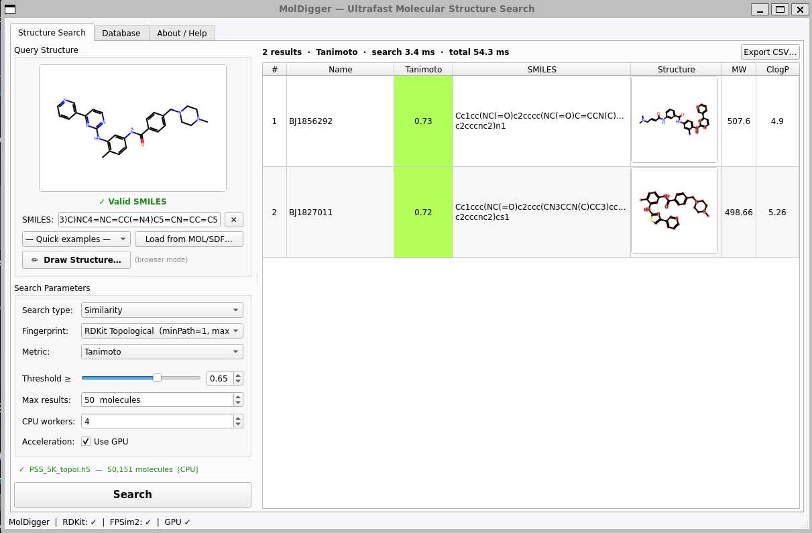

# MolDigger

**Ultrafast molecular structure search with a PyQt5 GUI**

MolDigger is a desktop application for searching large chemical databases by molecular similarity or substructure. It uses [FPSim2](https://github.com/chembl/FPSim2) for fingerprint-based similarity search (capable of screening millions of compounds in milliseconds) and [RDKit](https://www.rdkit.org/) for substructure matching, 2D depiction, and property calculation.



---

## Features

- **Similarity search** — Tanimoto, Dice, and Tversky metrics with adjustable threshold
- **Substructure search** — SMILES or SMARTS queries with multi-threaded RDKit matching
- **GPU acceleration** — NVIDIA CUDA via FPSim2's CudaEngine (Tanimoto only)
- **Multiple fingerprint types** — Morgan/ECFP4, ECFP6, FCFP4, RDKit Topological, MACCS Keys, Atom Pairs, Topological Torsion
- **Auto-detects fingerprint type** from the loaded database file
- **MCS highlighting** — maximum common substructure highlighted in hit thumbnails (similarity search)
- **Substructure highlighting** — matched atoms highlighted in orange (substructure search)
- **Structure editor** — [Ketcher](https://github.com/epam/ketcher) launched in browser; drawn structures sent back to the app automatically
- **Results table** — sortable, with 2D thumbnails, MW, ClogP; right-click to copy SMILES or use hit as new query
- **Stop button** — cancel any running search mid-way
- **Database builder** — create FPSim2 `.h5` databases from SDF or SMILES files within the app
- **Export** — save results to CSV

---

## Installation

### Requirements

- Python 3.10+
- Conda (recommended) or pip

### Conda (recommended)

```bash
conda create -n moldigger python=3.11
conda activate moldigger
conda install -c conda-forge rdkit
pip install fpsim2 PyQt5 numpy tables
```

### GPU support (optional)

Requires an NVIDIA GPU with CUDA installed. Match the `cupy` version to your CUDA installation:

```bash
pip install cupy-cuda12x   # for CUDA 12.x
# or
pip install cupy-cuda11x   # for CUDA 11.x
```

GPU availability is detected automatically at startup. If available, a **Use GPU** checkbox appears in the search parameters panel.

---

## Quick Start

```bash
conda activate moldigger
python moldigger.py
```

1. **Database tab** → load an existing `.h5` file, or build one from an SDF/SMILES file
2. **Structure Search tab** → type a SMILES or SMARTS query (live 2D preview updates as you type)
3. Choose **Search type** (Similarity or Substructure), fingerprint, metric, and threshold
4. Click **Search**
5. Click **Search** again while running to **stop** it

---

## Building a Database

1. Go to the **Database** tab
2. Select an input file (SDF or SMILES)
3. Choose fingerprint type and output path
4. Click **Create Database**

The app writes a `.h5` FPSim2 database and a companion `.h5.smiles.json` file that stores SMILES strings and molecule names for display in the results table.

---

## Search Types

### Similarity Search

Finds molecules with similar fingerprints to the query using a chosen metric:

| Metric | Description |
|--------|-------------|
| **Tanimoto** | Standard Jaccard similarity — most common in cheminformatics |
| **Dice** | `2|A∩B| / (|A|+|B|)` — gives higher scores than Tanimoto |
| **Tversky** | Asymmetric; α=1, β=0 finds larger molecules containing your scaffold |

Set the threshold slider to control the minimum score returned. Results are colour-coded green (score = 1.00) → yellow → orange → red (low similarity).

### Substructure Search

Finds all molecules containing the query as a substructure. Accepts:
- **SMILES** — exact substructure match
- **SMARTS** — flexible pattern matching, e.g.:
  - `c1ccccc1` — any benzene ring
  - `[#6]-C(=O)-[#7]` — amide bond
  - `[F,Cl,Br,I]` — any halogen
  - `[n;H1]` — NH in an aromatic ring

Matched atoms are highlighted in orange in the hit thumbnails. Runs on CPU using all configured worker threads.

---

## Fingerprint Types

| Name | FPSim2 type | Notes |
|------|-------------|-------|
| Morgan / ECFP4 | Morgan, radius=2 | Most common for drug-like molecules |
| Morgan / ECFP6 | Morgan, radius=3 | Larger neighbourhood |
| Morgan / FCFP4 | Morgan, radius=2 | Feature-based (pharmacophore-aware) |
| RDKit Topological | RDKit | Path-based |
| MACCS Keys | MACCSKeys | 166-bit, interpretable |
| Atom Pairs | AtomPair | Counts atom-pair types |
| Topological Torsion | TopologicalTorsion | Encodes torsion angles |

The fingerprint type is automatically detected from the loaded `.h5` file.

---

## Performance

- FPSim2 screens **millions of molecules in < 1 second** on CPU (multi-threaded)
- GPU mode (CUDA) provides an additional **5–50× speedup** for large databases
- Substructure search is parallelised across all CPU workers using `ThreadPoolExecutor`
- The `.h5` database is memory-mapped — loading is near-instantaneous
- The results label reports both the **search time** (FPSim2/RDKit computation) and **total time** (including 2D rendering)

---

## Structure Editor (Ketcher)

MolDigger integrates [Ketcher](https://github.com/epam/ketcher) (MIT) as a structure editor. Click **Draw Structure** to open Ketcher in your browser. Draw or paste a structure, then click **Use this structure** — the SMILES is sent back to MolDigger automatically. You can modify and resubmit without restarting.

> **Note for WSL2 users:** Qt WebEngine (embedded browser) does not work reliably under WSL2 due to OpenGL/GLX limitations. MolDigger automatically detects this and falls back to launching Ketcher in your system browser on a local port (18920). On native Linux or Windows this limitation does not apply.

---

## Dependencies

| Package | Purpose | License |
|---------|---------|---------|
| [FPSim2](https://github.com/chembl/FPSim2) | Fingerprint similarity search | MIT |
| [RDKit](https://www.rdkit.org/) | Cheminformatics, substructure search, depiction | BSD-3-Clause |
| [PyQt5](https://riverbankcomputing.com/software/pyqt/) | GUI framework | GPL v3 / commercial |
| [PyTables](https://www.pytables.org/) | HDF5 I/O | BSD |
| [NumPy](https://numpy.org/) | Array operations | BSD |
| [CuPy](https://cupy.dev/) *(optional)* | GPU array library for CUDA | MIT |
| [Ketcher](https://github.com/epam/ketcher) *(optional)* | Structure editor | MIT |

---

## License

MIT
